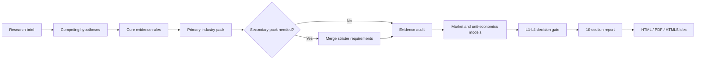

# Industry Deep Research Report

[](https://github.com/wyh583/industry-deep-research-report/actions/workflows/validate.yml)
[](https://github.com/wyh583/industry-deep-research-report/releases)
[](https://www.python.org/)
[](./industry-deep-research-report/SKILL.md)

**English** · [简体中文](./README.zh-CN.md)

A decision-grade Codex Skill for industry research, market entry, product validation, commercial investment, and investment diligence.

It turns public evidence into a concise Chinese decision report with competing hypotheses, source boundaries, reproducible market models, and automated quality gates—not a generic search summary.

## Why use it?

| Typical research agent | Industry Deep Research Report |
|---|---|
| Collects supporting links | Searches for supporting and falsifying evidence |
| Counts webpages as independent sources | Tracks original-source lineage and independence |
| Uses one market-size estimate | Requires top-down and bottom-up models when feasible |
| Treats all industries alike | Loads conditional evidence rules for the selected industry |
| Produces a narrative answer | Produces a 10-section report plus structured research artifacts |
| Leaves confidence implicit | States supported decision level, gaps, and falsification conditions |

## How it works



## Core capabilities

- Fixed 10-section, decision-oriented report structure
- `quick`, `standard`, and `deep` research modes
- Competing hypotheses, counterevidence search, and confidence tracking
- Claim-to-evidence mapping and original-source independence checks
- Top-down and bottom-up market sizing
- Unit economics, break-even, scenarios, and sensitivity analysis
- L1-L4 evidence-backed decision levels
- Universal evidence core plus conditional industry packs
- Structured `.research/` artifacts and automated quality gates
- HTML, PDF, and HTMLSlides delivery workflows

## Industry evidence packs

| Pack | Typical use |
|---|---|
| `consumer-retail` | Consumer products, brands, and retail categories |
| `saas-ai` | SaaS, AI products, developer tools, and digital services |
| `manufacturing` | Equipment, components, factories, and industrial hardware |
| `ecommerce-platform` | Marketplaces, cross-border ecommerce, and merchant platforms |
| `healthcare` | Medical devices, drugs, clinical services, and digital health |
| `restaurant-local-service` | Restaurants, stores, hospitality, and local services |

Each run loads one primary pack and optionally one secondary pack. Uncertain classifications fall back to the universal evidence core instead of forcing a poor match.

## Decision levels

Research depth and decision authority are independent.

| Level | Evidence may support |
|---|---|
| L1 | Continue or stop researching |
| L2 | Start a low-cost MVP or validation |
| L3 | Build a team and commit commercial resources |
| L4 | Invest, acquire, or scale materially |

If the requested decision exceeds the evidence, validation is blocked and the highest supported level is reported.

## Install

```bash
git clone https://github.com/wyh583/industry-deep-research-report.git
```

Copy the nested `industry-deep-research-report` directory into your Codex skills directory.

```powershell
$codexSkills = if ($env:CODEX_HOME) {
  Join-Path $env:CODEX_HOME "skills"
} else {
  Join-Path $env:USERPROFILE ".codex\skills"
}

Copy-Item `
  -LiteralPath ".\industry-deep-research-report\industry-deep-research-report" `
  -Destination (Join-Path $codexSkills "industry-deep-research-report") `
  -Recurse `
  -Force
```

## Use

```text
Use $industry-deep-research-report to analyze the US smart pet products market.
Use standard research depth and determine whether the evidence supports an L2 MVP.
```

Mixed-industry example:

```text
Use $industry-deep-research-report to analyze AI medical imaging software.
Load saas-ai as the primary evidence pack and healthcare as the secondary pack.
```

## Validate a report

```bash
python industry-deep-research-report/scripts/validate_report.py \
  --report <report.md> \
  --research-dir <.research-directory> \
  --mode standard
```

- Exit `0`: no blocking issue.
- Exit `1`: blocking evidence or model issue.
- Results are written to `.research/validation.json`.

See the sanitized [schema 1.1 brief example](./examples/brief.schema-1.1.json).

## Repository layout

```text
.
├── README.md
├── README.zh-CN.md
├── CONTRIBUTING.md
├── examples/
└── industry-deep-research-report/
    ├── SKILL.md
    ├── agents/
    ├── references/
    └── scripts/
```

## Requirements

- Python 3.9+
- Report validation uses the Python standard library only
- PDF export requires a local Chrome or Edge installation
- HTMLSlides delivery requires a compatible HTML Slides Skill

## Contributing

Issues and focused pull requests are welcome. See [CONTRIBUTING.md](./CONTRIBUTING.md).

## License

No open-source license is currently attached. Public access does not grant permission to copy, modify, or redistribute the project. A license should be selected before inviting broad reuse.
